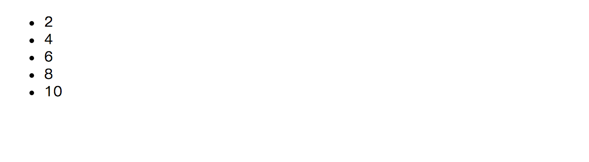

### 2.3 D3로 만들기

D3와 관련된 기술과 개발환경에 대해 알아보았으니 이제 실제로 D3를 이용해서 데이터를 시각화 해보자.
먼저 새로운 디렉토리를 만들고 웹서버를 실행한 다음 `index.html`이라는 이름으로 파일을 만들자.
웹 브라우져를 열고 `http://localhost:3000`을 입력한 다음 빈 화면을 확인하면 모든 준비는 끝났다.

#### 첫 시각화

`index.html`파일에 다음과 같은 내용을 입력한다.

```html
<!doctype html>
<html>
<head>
  <meta charset="utf-8">
  <title>D3</title>
</head>
<body>
  <script src="http://d3js.org/d3.v3.min.js" charset="utf-8"></script>
  <script>
    d3.select("body")
      .append("ul")
      .selectAll("li")
      .data([2, 4, 6, 8, 10])
      .enter()
      .append("li")
      .text(function (d) {
        return d;
      });
  </script>
</body>
</html>
```

브라우져를 새로고침해보자.



D3를 이용한 첫번째 데이터 시각화에 성공했다!
기대했던 막대 그래프나 원 그래프는 아니지만 `<li>`태그를 이용해서 데이터를 숫자로 표현했다.
아직 CSS와 SVG는 사용하지 않고 HTML과 Javascript를 이용한 아주 간단한 작업이지만 D3의 핵심적인 내용은 다 들어있다.
위 소스에 글자 대신 도형을 그리게 하고 CSS를 이용하면 멋진 색과 다양한 형태의 도형을 가진 시각화가 완성되는 것이다.
첫 시작은 다 이렇게 단순하게 시작하는 것이다.

#### 코드 살펴보기

그럼 위에서 작성한 코드가 무엇을 의미하는지 하나하나 살펴보자.


```html
<script src="http://d3js.org/d3.v3.min.js" charset="utf-8"></script>
```

HTML에게 d3.js 라이브러리를 사용하겠다고 알려준다.

```javascript
d3.select("body")
```

`body`요소를 `선택`한다. `body`에 뭔가 데이터를 추가하고 수정하고 삭제할 예정이므로 일단 선택해야 한다.

```javascript
.append("ul")
```

위에서 선택한 `body`요소에 `ul`요소를 `붙인`다. 데이터를 `<li>`를 통해 시각화 할 것이므로 `ul`요소가 필요하다.

```javascript
.selectAll("li")
```

위에서 선택한 `ul`요소에 있는 `li`요소를 `전체선택`한다.
이부분이 이상하게 느껴질 수 있는데 왜냐하면 `body`는 HTML에 입력했으므로 선택할 수 있고 `ul`은 새로운 것이므로 붙일 수 있는데 아직 `li`요소는 없기때문이다.
아직 없는걸 선택한다고 생각하면 이상할 수 있지만 D3는 조금 다르게 작동한다.
D3에서는 아직 없지만 앞으로 추가할 부분에 대해서도 미리 선택해야 한다. 미리 선택하고 추후에 `data`를 연결한다.

```javascript
.data([2, 4, 6, 8, 10])
```

위에 전체선택한(아직 비어있는) 셀렉션에 data를 연결한다. 2, 4, 6, 8, 10의 5가지 숫자를 연결했다.

```javascript
.enter()
```

각 데이터가 포함된 셀렉션을 반환한다. 이제 각 데이터를 이용하여 요소를 추가할 수 있도록 `준비`된 상태다.
아직 화면상의 변화는 없다.

```javascript
.append("li")
```

각 데이터가 연결된 셀렉션마다 `li`요소를 추가한다.
총 5개의 데이터가 있으므로 5개가 추가되며 위에서 추가한 `ul`밑에 추가된다.
실제 화면에 `li`요소가 추가된다.

```javascript
.text(function (d) {
  return d;
});
```

추가한 `li`요소에 글자를 입력한다.
여기서는 `function (d) { return d; }`라는 익명함수를 사용했는데 익명함수의 인자값(d)으로 자동으로 data의 값이 입력된다.
각 데이터가 2, 4, 6, 8, 10이므로 첫번째는 `2`, 두번째는 `4`가 입력된다.

---

처음으로 작성한 D3를 이용한 코드에 대해 알아보았다.
아직 익숙하지 않겠지만 조금씩 코드를 변형해보고 살을 붙여간다면 금방 익숙해질거라고 생각한다.
